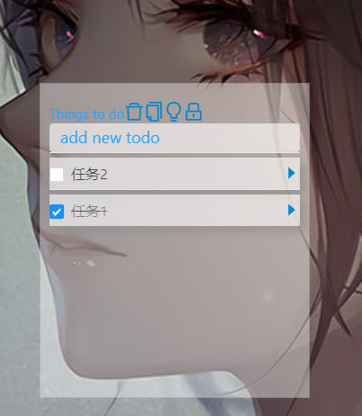

<p align="center">
    
  </a>
</p>

<h1 align="center">Tingstodo</h1>

<div align="center">
  <strong>
   Tingstodo 是一个浮层式的半透明Todo应用，并且支持鼠标穿透效果，避免误触。
  </strong>
</div>
<br>

## 功能
- 新增todo项
- todo项的勾选
- 删除勾选的todo项
- 导出数据为json格式
- 调整透明度
- 锁定、解锁操作，点锁定应用增加鼠标穿透效果，避免误触，点击解锁后恢复



## 安装使用

选择自己系统的版本，解压或者安装使用，[下载地址](https://github.com/xiaofine1122/Tingstodo1.0/releases)


# 使用

## 前提

需要安装 [nodejs](https://nodejs.org/en/) 、[npm](https://www.npmjs.com/)和 [npm]()

## 使用说明

```bash
$ yarn install
```

运行主程序
```bash
$ yarn start
```

运行electron
```bash
$ cd .\src\meta\
$ electron .
```

## 打包

```bash
$ yarn build
```
将 .\src\meta\ 下 main.js 、package.json、tingstodo.icns、tingstodo.ico复制到build目录
修改main.js
```
win.loadURL( `file://${__dirname}/index.html` );
```

执行
```bash
$ yarn packager_all #或者package.json scripts下的其他命令
```

打包mac下的应用需要在 macos系统中运行


## 作者和致谢（可选）

感谢[Easy](https://github.com/easychen)老师的全栈课程。

## TODO
后续会增加其他内容，如json导入，或者其他端的同步
